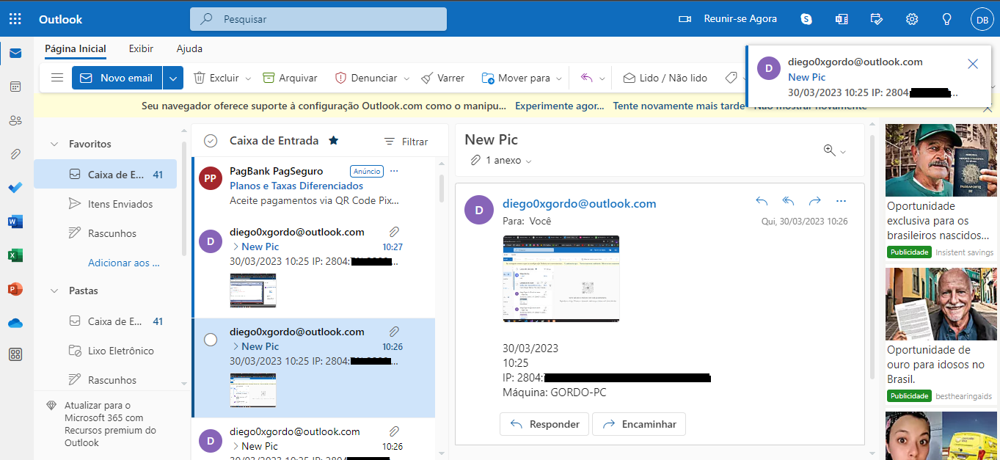
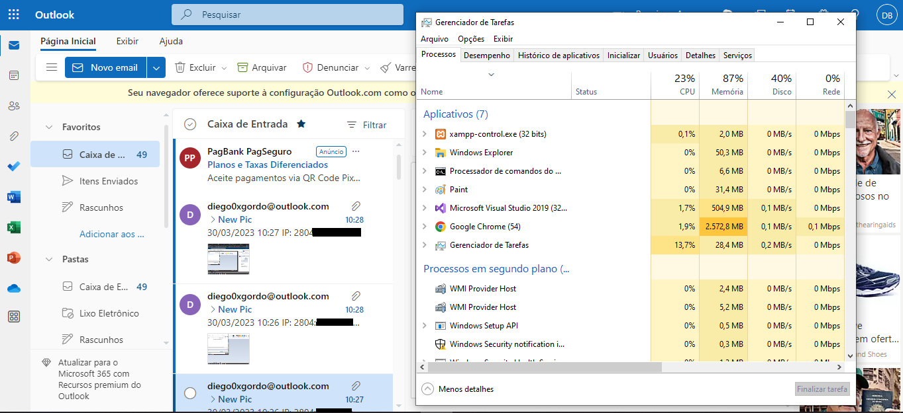
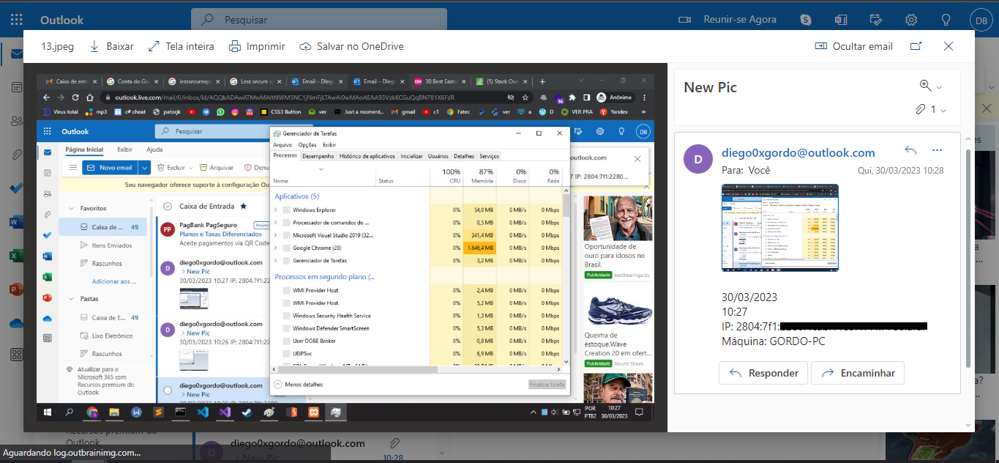

# Screenlogger-Sharp
This is a simple screenloger developed in C# for educational purposes only. The use of this code for malicious purposes is not my responsibility. Run only if you have permission!

<h2>How it works</h2>
After running on the machine, the screenlogger will add a value to the Windows registry so that the program is automatically executed every time the computer is started. The program will take a screenshot every 5 seconds of the computer screen, save it in a random folder inside the Windows folder and then send an email containing the screenshot, IP address, date, time and machine name. After 5 seconds the process repeats itself. In this way, you can monitor what the victim is doing on the computer, what they are seeing and accessing. It is a great monitoring tool. The tool also remains invisible, not appearing in the task manager or anywhere else. Just run it once for it to always be running and remain completely invisible.

<h2>Email</h2>
When you perform the test, I recommend using Outlook and its SMTP service. Gmail's service has been blocking emails due to the deactivation of the 'Less secure apps' feature.

<h2>Examples</h2>

 Hidden in task manager

 

